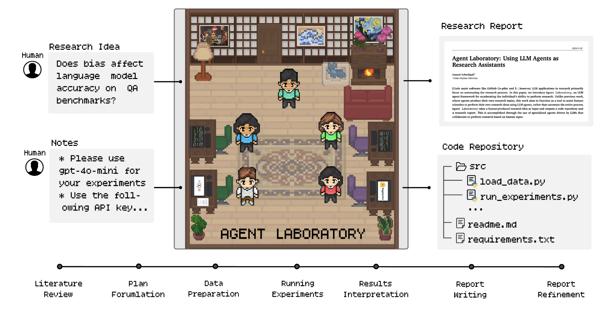
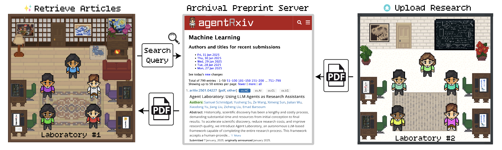

# fzy Agent: Using LLM Agents as Research Assistants


<p align="center">
  
</p>

<p align="center">
    【English | <a href="readme/README-chinese.md">中文</a> | <a href="readme/README-japanese.md">日本語</a> | <a href="readme/README-korean.md">한국어</a> | <a href="readme/README-filipino.md">Filipino</a> | <a href="readme/README-french.md">Français</a> | <a href="readme/README-slovak.md">Slovenčina</a> | <a href="readme/README-portugese.md">Português</a> | <a href="readme/README-spanish.md">Español</a> | <a href="readme/README-turkish.md">Türkçe</a> | <a href="readme/README-hindi.md">हिंदी</a> | <a href="readme/README-bengali.md">বাংলা</a> | <a href="readme/README-vietnamese.md">Tiếng Việt</a> | <a href="readme/README-russian.md">Русский</a> | <a href="readme/README-arabic.md">العربية</a> | <a href="readme/README-farsi.md">فارسی</a> | <a href="readme/README-italian.md">Italiano</a>】
</p>

<p align="center">
    【📝 <a href="https://arxiv.org/pdf/2501.04227">Paper</a> | 🌐 <a href="https://agentlaboratory.github.io/">Website</a> | 🌐 <a href="https://agentrxiv.github.io/">AgentRxiv Website</a> | 💻 <a href="https://github.com/SamuelSchmidgall/AgentLaboratory">Software</a> | 📰 <a href="https://agentlaboratory.github.io/#citation-ref">Citation</a>】
</p>

### News 
* [March/24/2025] 🎉 🎊 🎉 Now introducing **AgentRxiv**, a framework where autonomous research agents can upload, retrieve, and build on each other's research. This allows agents to make cumulative progress on their research.

## 📖 Overview

- **fzy Agent** is an end-to-end autonomous research workflow meant to assist **you** as the human researcher toward **implementing your research ideas**. fzy Agent consists of specialized agents driven by large language models to support you through the entire research workflow—from conducting literature reviews and formulating plans to executing experiments and writing comprehensive reports. 
- This system is not designed to replace your creativity but to complement it, enabling you to focus on ideation and critical thinking while automating repetitive and time-intensive tasks like coding and documentation. By accommodating varying levels of computational resources and human involvement, fzy Agent aims to accelerate scientific discovery and optimize your research productivity.
<p align="center">
  
</p>

- fzy Agent also supports **AgentRxiv**, a framework where autonomous research agents can upload, retrieve, and build on each other's research. This allows agents to make cumulative progress on their research.

<p align="center">
  
</p>


### 🔬 How does fzy Agent work?

- fzy Agent consists of three primary phases that systematically guide the research process: (1) Literature Review, (2) Experimentation, and (3) Report Writing. During each phase, specialized agents driven by LLMs collaborate to accomplish distinct objectives, integrating external tools like arXiv, Hugging Face, Python, and LaTeX to optimize outcomes. This structured workflow begins with the independent collection and analysis of relevant research papers, progresses through collaborative planning and data preparation, and results in automated experimentation and comprehensive report generation. Details on specific agent roles and their contributions across these phases are discussed in the paper.

<p align="center">
  
</p>


### 👾 Currently supported models

* **OpenAI**: o1, o1-preview, o1-mini, gpt-4o, o3-mini
* **DeepSeek**: deepseek-chat (deepseek-v3)

To select a specific llm set the flag `--llm-backend="llm_model"` for example `--llm-backend="gpt-4o"` or `--llm-backend="deepseek-chat"`. Please feel free to add a PR supporting new models according to your need!

## 🖥️ Installation

### Python venv option

* We recommend using python 3.12

1. **Clone the GitHub Repository**: Begin by cloning the repository using the command:
```bash
git clone git@github.com:SamuelSchmidgall/AgentLaboratory.git
```

2. **Set up and Activate Python Environment**
```bash
python -m venv venv_agent_lab
```
- Now activate this environment:
```bash
source venv_agent_lab/bin/activate
```

3. **Install required libraries**
```bash
pip install -r requirements.txt
```

4. **Install pdflatex [OPTIONAL]**
```bash
sudo apt install pdflatex
```
- This enables latex source to be compiled by the agents.
- **[IMPORTANT]** If this step cannot be run due to not having sudo access, pdf compiling can be turned off via running fzy Agent via setting the `--compile-latex` flag to false: `--compile-latex "false"`


5. **Now run fzy Agent!**

`python ai_lab_repo.py --yaml-location "experiment_configs/MATH_agentlab.yaml"`


### Co-Pilot mode

To run fzy Agent in copilot mode, simply set the copilot-mode flag in your yaml config to `"true"`

-----
## Tips for better research outcomes


#### [Tip #1] 📝 Make sure to write extensive notes! 📝

**Writing extensive notes is important** for helping your agent understand what you're looking to accomplish in your project, as well as any style preferences. Notes can include any experiments you want the agents to perform, providing API keys, certain plots or figures you want included, or anything you want the agent to know when performing research.

This is also your opportunity to let the agent know **what compute resources it has access to**, e.g. GPUs (how many, what type of GPU, how many GBs), CPUs (how many cores, what type of CPUs), storage limitations, and hardware specs.

In order to add notes, you must modify the task_notes_LLM structure inside of `ai_lab_repo.py`. Provided below is an example set of notes used for some of our experiments. 


```
task-notes:
  plan-formulation:
    - 'You should come up with a plan for only ONE experiment aimed at maximizing performance on the test set of MATH using prompting techniques.'
    - 'Please use gpt-4o-mini for your experiments'
    - 'You must evaluate on the entire 500 test questions of MATH'
  data-preparation:
    - 'Please use gpt-4o-mini for your experiments'
    - 'You must evaluate on the entire 500 test questions of MATH'
    - 'Here is a sample code you can use to load MATH\nfrom datasets import load_dataset\nMATH_test_set = load_dataset("HuggingFaceH4/MATH-500")["test"]'
...
```

--------

#### [Tip #2] 🚀 Using more powerful models generally leads to better research 🚀

When conducting research, **the choice of model can significantly impact the quality of results**. More powerful models tend to have higher accuracy, better reasoning capabilities, and better report generation. If computational resources allow, prioritize the use of advanced models such as o1-(mini/preview) or similar state-of-the-art large language models.

However, **it's important to balance performance and cost-effectiveness**. While powerful models may yield better results, they are often more expensive and time-consuming to run. Consider using them selectively—for instance, for key experiments or final analyses—while relying on smaller, more efficient models for iterative tasks or initial prototyping.

When resources are limited, **optimize by fine-tuning smaller models** on your specific dataset or combining pre-trained models with task-specific prompts to achieve the desired balance between performance and computational efficiency.

-----

#### [Tip #3] ✅ You can load previous saves from checkpoints ✅

**If you lose progress, internet connection, or if a subtask fails, you can always load from a previous state.** All of your progress is saved by default in the `state_saves` variable, which stores each individual checkpoint. 

-----


#### [Tip #4] 🈯 If you are running in a language other than English 🈲

If you are running fzy Agent in a language other than English, no problem, just make sure to provide a language flag to the agents to perform research in your preferred language. Note that we have not extensively studied running fzy Agent in other languages, so be sure to report any problems you encounter.

For example, if you are running in Chinese set the language in the yaml:

`language:  "中文"`

----


#### [Tip #5] 🌟 There is a lot of room for improvement 🌟

There is a lot of room to improve this codebase, so if you end up making changes and want to help the community, please feel free to share the changes you've made! We hope this tool helps you!


## 📜 License

Source Code Licensing: Our project's source code is licensed under the MIT License. This license permits the use, modification, and distribution of the code, subject to certain conditions outlined in the MIT License.

## 📬 Contact

If you would like to get in touch, feel free to reach out to [sschmi46@jhu.edu](mailto:sschmi46@jhu.edu)

## Reference / Bibtex


### fzy Agent
```bibtex
@misc{schmidgall2025agentlaboratoryusingllm,
      title={fzy Agent: Using LLM Agents as Research Assistants}, 
      author={Samuel Schmidgall and Yusheng Su and Ze Wang and Ximeng Sun and Jialian Wu and Xiaodong Yu and Jiang Liu and Zicheng Liu and Emad Barsoum},
      year={2025},
      eprint={2501.04227},
      archivePrefix={arXiv},
      primaryClass={cs.HC},
      url={https://arxiv.org/abs/2501.04227}, 
}
```

### AgentRxiv
```bibtex
@misc{schmidgall2025agentrxiv,
      title={AgentRxiv: Towards Collaborative Autonomous Research}, 
      author={Samuel Schmidgall and Michael Moor},
      year={2025},
      eprint={2503.18102},
      archivePrefix={arXiv},
      primaryClass={cs.AI},
      url={https://arxiv.org/abs/2503.18102}, 
}
```

## 🔄 多用户支持与文件管理

Agent Laboratory现已支持多用户并行使用和隔离的文件管理系统，特别适合需要构建网站界面供多人使用的场景。

### 主要改进：

1. **用户会话管理**：
   - 为每个用户创建唯一的会话ID
   - 所有用户数据关联到其唯一标识符
   - 自动创建用户专属数据目录

2. **安全的文件隔离**：
   - 每个用户的数据、代码和生成的图片严格隔离
   - 防止用户间数据泄露或干扰
   - 自动权限检查确保用户只能访问自己的数据

3. **改进的文件管理**：
   - 所有生成的图像和文件保存在用户自己的目录中
   - 解决了之前图片直接保存在根目录的问题
   - 为matplotlib绘图添加自动重定向功能

4. **研究任务API**：
   - 新增API端点用于启动研究任务
   - 支持跟踪研究进度和获取结果
   - 异步执行长时间运行的实验

5. **定期清理机制**：
   - 自动清理过期的用户数据和任务
   - 优化存储空间使用
   - 可配置的数据保留策略

### 技术实现：

- 使用Flask会话管理用户状态
- 修改文件生成逻辑，包括matplotlib绘图函数
- 添加用户权限验证层
- 实现异步任务处理机制
- 建立数据库模型追踪用户和任务

### 使用方法：

用户现在可以通过网站界面提交研究请求，系统会自动为其创建独立的工作环境，并保存所有研究成果在用户专属目录中。用户可以随时查看研究进度、下载报告和图表，而无需担心与其他用户的数据混淆。

# AgentLaboratory Web服务器集成

本项目实现了AgentLaboratory研究自动化框架与Web服务器的集成，使用户可以通过Web界面轻松启动和管理自动化研究任务。

## 主要功能

- 通过Web界面管理研究任务
- 支持多种语言的研究报告生成
- 用户数据管理和会话控制
- 论文上传和搜索功能
- 研究结果可视化和共享
- 与AgentRxiv集成，支持自主研究代理之间的协作

## 论文版本自动切换功能

为了提高论文获取的成功率，系统现在支持在论文查询失败时自动尝试获取同一论文的不同版本。

### 主要特性：

1. **自动版本切换**：
   - 当论文查询达到最大重试次数(5次)后仍然失败时，系统会自动尝试查询同一论文的其他版本
   - 支持在带版本号的论文ID(如1611.05431v3)和不带版本号的ID之间智能切换

2. **版本遍历**：
   - 对于带版本号的论文ID，系统会尝试v1到v5的所有版本
   - 对于不带版本号的论文ID，系统会尝试添加v1后缀进行查询

3. **错误处理优化**：
   - 针对常见的论文获取错误(如"object has no attribute 'updated_parsed'")提供了解决方案
   - 减少因特定版本不可用导致的研究中断

4. **用户友好提示**：
   - 当成功获取到替代版本时，系统会清晰标明原始版本和替代版本信息
   - 提供详细的错误日志，便于问题排查

这一功能显著提高了系统获取研究论文的稳定性，特别是在处理arXiv上的论文时，确保研究流程不会因单个论文版本的获取问题而中断。

## 技术改进

### 配置整合

我们对`app.py`进行了修改，整合了`ai_lab_repo.py`中的配置逻辑，主要包括：

1. 添加命令行参数支持，允许用户指定端口和配置文件：
   ```python
   parser = argparse.ArgumentParser(description="AgentLaboratory Web Server")
   parser.add_argument('--port', type=int, default=5000, help='Web服务器监听端口')
   parser.add_argument('--yaml-location', type=str, default="experiment_configs/MATH_agentlab.yaml", help='YAML配置文件路径，用于加载默认配置')
   ```

2. 从YAML配置文件加载默认设置，并存储在app.config中：
   ```python
   app.config['DEFAULT_LLM_BACKBONE'] = config.get('llm-backend', "o4-mini-yunwu")
   app.config['DEFAULT_LANGUAGE'] = config.get('language', '中文')
   app.config['DEFAULT_NUM_PAPERS_LIT_REVIEW'] = config.get('num-papers-lit-review', 5)
   # 更多配置...
   ```

3. 支持API密钥的环境变量设置：
   ```python
   api_key = config.get('api-key')
   if api_key and not os.environ.get('OPENAI_API_KEY'):
       os.environ['OPENAI_API_KEY'] = api_key
   ```

### AgentRxiv支持

为了支持AgentRxiv功能，我们进行了以下改进：

1. 修改了`AgentRxiv`类，使其能够接受端口参数：
   ```python
   def __init__(self, lab_index=0, port=None):
       self.port = port if port is not None else 5000 + self.lab_index
   ```

2. 在`run_app`函数中初始化全局AgentRxiv实例：
   ```python
   if AI_LAB_AVAILABLE:
       from ai_lab_repo import AgentRxiv
       import ai_lab_repo
       ai_lab_repo.GLOBAL_AGENTRXIV = AgentRxiv(lab_index=app.config.get('DEFAULT_LAB_INDEX', 0), port=port)
   ```

3. 在`run_research_task`函数中确保AgentRxiv正确初始化：
   ```python
   if agentRxiv and not ai_lab_repo.GLOBAL_AGENTRXIV:
       lab_index = workflow_params.get('lab_index', 0)
       ai_lab_repo.GLOBAL_AGENTRXIV = AgentRxiv(lab_index=lab_index)
   ```

### 研究任务处理改进

我们对`run_research_task`函数进行了全面改进：

1. 使用app.config中的默认值作为配置回退：
   ```python
   if 'num-papers-lit-review' in config:
       workflow_params['num_papers_lit_review'] = config['num-papers-lit-review']
   elif 'DEFAULT_NUM_PAPERS_LIT_REVIEW' in app.config:
       workflow_params['num_papers_lit_review'] = app.config['DEFAULT_NUM_PAPERS_LIT_REVIEW']
   ```

2. 改进了任务笔记的处理逻辑，支持多语言：
   ```python
   # 处理任务笔记，转换为LaboratoryWorkflow可接受的格式
   task_notes_LLM = []
   task_notes = config['task-notes']
   
   # 收集所有实际涉及的任务阶段
   phases_in_notes = set()
   
   for _task in task_notes:
       readable_phase = _task.replace("-", " ")
       phases_in_notes.add(readable_phase)
       for _note in task_notes[_task]:
           task_notes_LLM.append({"phases": [readable_phase], "note": _note})
   ```

3. 添加了agent模型配置：
   ```python
   llm_backend = config.get('llm-backend', app.config.get('DEFAULT_LLM_BACKBONE', 'o4-mini-yunwu'))
   agent_models = {
       "literature review": llm_backend,
       "plan formulation": llm_backend,
       # 更多阶段...
   }
   workflow_params['agent_model_backbone'] = agent_models
   ```

## 使用方法

启动服务器：
```bash
python app.py --port 5000 --yaml-location "experiment_configs/MATH_agentlab.yaml"
```

访问Web界面：
```
http://localhost:5000
```

## 注意事项

- 确保已安装所有必要的依赖项
- 在启用AgentRxiv功能时，确保服务器在正确的端口上运行
- 对于非英语研究，请在配置文件中设置适当的语言参数

# 多用户环境下的文件路径修复

本次修改解决了多用户环境下文件保存路径的问题，确保每个用户的文件都保存在各自的项目目录中，而不是保存在根目录。

## 主要修改

1. **工作目录切换**
   - 在 `worker_run_code` 函数中添加了工作目录切换逻辑，确保代码执行时使用用户的项目目录作为当前工作目录
   - 添加了恢复原始工作目录的逻辑，确保执行结束后恢复系统状态

2. **文件路径处理**
   - 修改了 `save_to_file` 函数，处理相对路径前缀，确保文件保存在正确的位置
   - 在 `worker_run_code` 函数中添加了文件路径处理逻辑，包括：
     - 重定向 `open` 函数，确保相对路径的文件操作在用户目录中进行
     - 添加 `ensure_user_path` 辅助函数，用于处理各种文件路径
     - 替换常见的文件操作模式，如 `plt.savefig`、`with open`、`.to_csv` 等

3. **修正相对路径使用**
   - 修改了 `ai_lab_repo.py` 中的 `save_to_file` 调用，去掉了相对路径前缀 `./`
   - 使用 `os.path.join` 构建文件路径，确保路径分隔符的正确性和平台兼容性

## 效果

这些修改确保了：

1. 所有生成的文件（包括图像、数据文件等）都保存在用户的项目目录中
2. 即使代码中使用了相对路径，也会被重定向到用户的项目目录
3. 不同用户的文件不会相互干扰

这使得系统可以安全地在多用户环境中运行，每个用户的研究项目都有自己独立的文件空间。

# 修复状态保存序列化问题

本次修改解决了在保存研究状态时出现的 "Can't pickle local object 'run_research_task.<locals>.<lambda>'" 错误。

## 问题描述

在多用户环境下，系统使用 pickle 模块来序列化和保存研究任务的状态，以便在需要时恢复。然而，当研究任务中包含局部定义的 lambda 函数作为回调时，pickle 无法序列化这些函数，导致状态保存失败。

## 解决方案

1. **创建全局回调包装器**：
   - 添加了 `state_callback_wrapper` 函数，它接收 `task_id` 参数并返回一个可序列化的回调函数
   - 这个包装器函数在模块级别定义，而不是在函数内部定义，因此可以被 pickle 序列化

2. **替换 lambda 函数**：
   - 将 `run_research_task` 函数中的 lambda 表达式替换为对 `state_callback_wrapper` 的调用
   - 将 `continue_research_task` 函数中的 lambda 表达式也进行了相同的替换

3. **保持参数传递**：
   - 通过闭包机制，`state_callback_wrapper` 返回的函数仍然可以访问 `task_id` 参数
   - 返回的函数签名与原始 lambda 函数相同，保持了接口的一致性

## 效果

这些修改确保了：

1. 研究任务状态可以正确序列化和保存
2. 用户可以暂停和恢复研究任务而不会遇到序列化错误
3. 回调函数仍然能够正确地将状态保存事件通知给数据库

这一改进增强了系统的稳定性和可靠性，特别是在长时间运行的研究任务中，用户可以安全地暂停和恢复任务，而不会丢失进度。

## Code Execution Mechanism Optimization

To improve system transparency and debuggability, we have optimized the code execution mechanism. The main improvements include:

### Improvements

1. **Code File Saving**: The system now first saves the generated code to a `generated_code.py` file in the user's project folder before executing it, rather than directly executing the code string in memory.

2. **Execution Transparency**: Users can view and modify the generated code file before or after execution, enhancing the system's transparency and controllability.

3. **Debugging Convenience**: By saving the code to a file, users can more easily debug and modify AI-generated code, especially in complex experiments and data processing tasks.

4. **Enhanced Execution Results**: The `execute_code` function now returns richer information, including execution output and code file path, making it easier for users to perform further operations.

### Effects

1. **Enhanced Visibility**: Users can directly view the AI-generated code instead of treating it as a black box execution.

2. **Simplified Debugging Process**: When code execution fails, users can directly view and modify the saved code file without having to extract code snippets from error messages.

3. **Improved User Control**: Users can review the generated code before execution, enhancing the system's controllability and security.

4. **Support for Iterative Development**: Users can iteratively develop based on AI-generated code, further improving experimental results.

This optimization provides a better user experience and higher transparency while maintaining automation, particularly suitable for research scenarios requiring fine-grained control and debugging.

## Fixed Code Execution Return Value Handling

To address potential type errors in the code execution process, we have further optimized the code execution mechanism:

### Improvements

1. **Unified Return Format**: Modified the `execute_code` function to ensure a consistent dictionary format is returned in all cases (including error cases), containing `output` and `code_file` fields.

2. **Enhanced Robustness**: Added more comprehensive type checking and handling in the `run_code` method of `mlesolver.py`, capable of correctly processing various possible return value types.

3. **Backward Compatibility**: Maintained compatibility with older versions that directly return string formats, ensuring smooth transitions during system upgrades.

### Effects

1. **Avoided Type Errors**: Resolved the `TypeError: string indices must be integers, not 'str'` error caused by inconsistent return value formats.

2. **Improved Stability**: Enhanced system stability in various execution environments, especially when handling error situations.

3. **Better User Experience**: Reduced task failures due to internal errors, improving the completion rate of user research tasks.

This fix ensures that the code execution mechanism works properly in all scenarios, enhancing the overall stability and reliability of the system.

## Optimized Task Status Display

To enhance user experience and provide more timely system feedback, we have optimized the task status display mechanism:

### Improvements

1. **Immediate Status Updates**: Modified the task creation logic to display tasks as "running" immediately after submission, rather than the default "pending" status.

2. **Eliminated Status Delays**: Removed redundant status update operations in background threads, ensuring status changes are immediately reflected to users.

3. **Streamlined Process**: Simplified the status update workflow, reducing unnecessary database operations.

### Effects

1. **Enhanced User Experience**: Users can immediately see that their task has started executing, reducing uncertainty during wait times.

2. **More Accurate Status Feedback**: System status displays more accurately reflect the actual task execution state.

3. **Reduced User Confusion**: Prevents confusion and duplicate submissions that might occur when tasks remain in "pending" status for extended periods.

This optimization makes system status feedback more timely and accurate, improving the overall user experience.